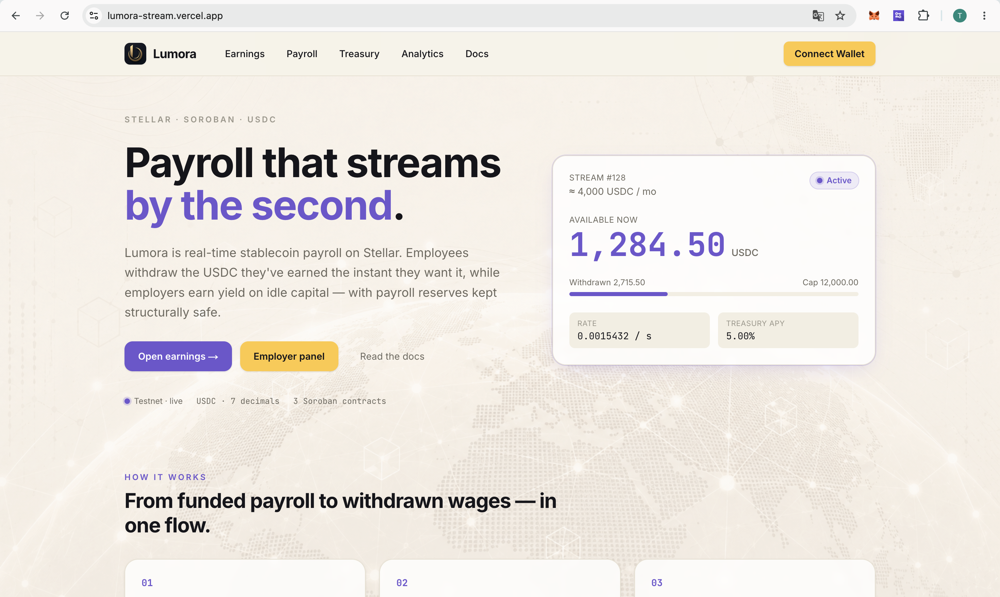
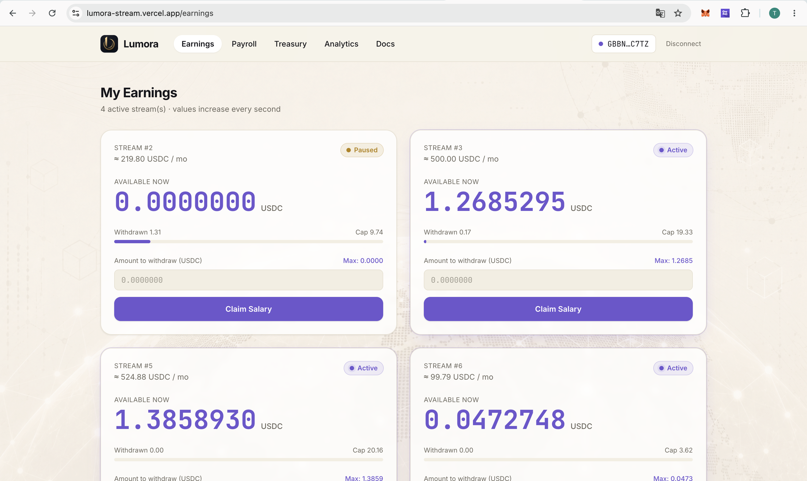
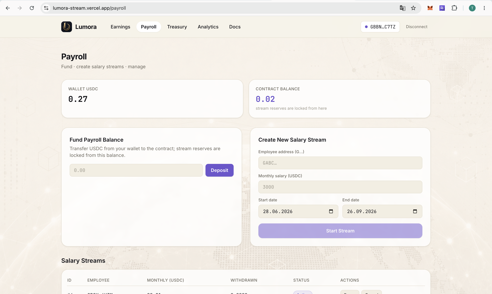
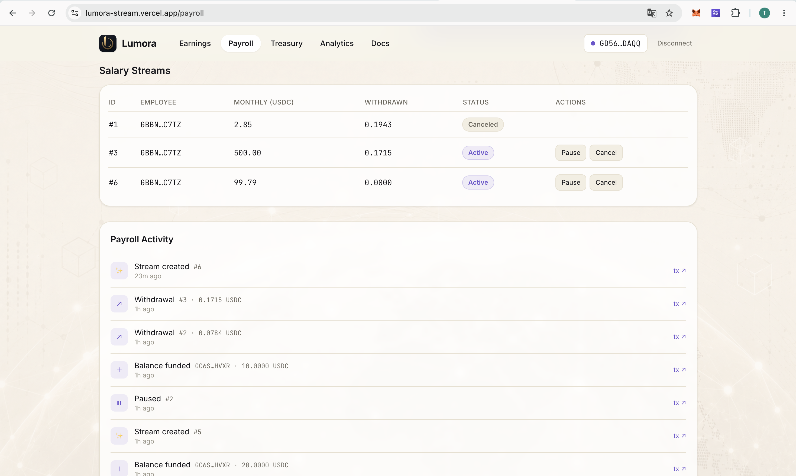
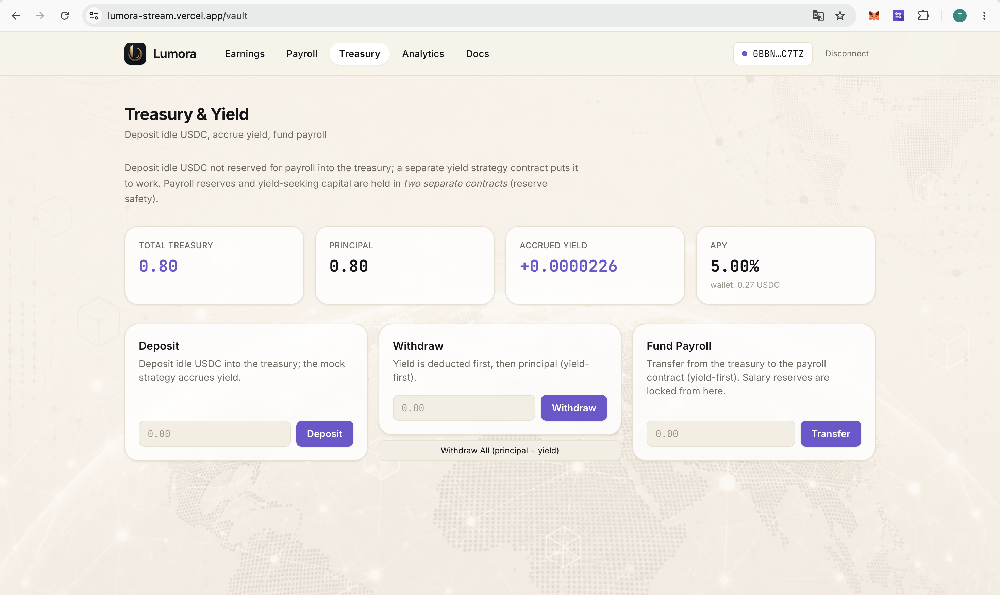
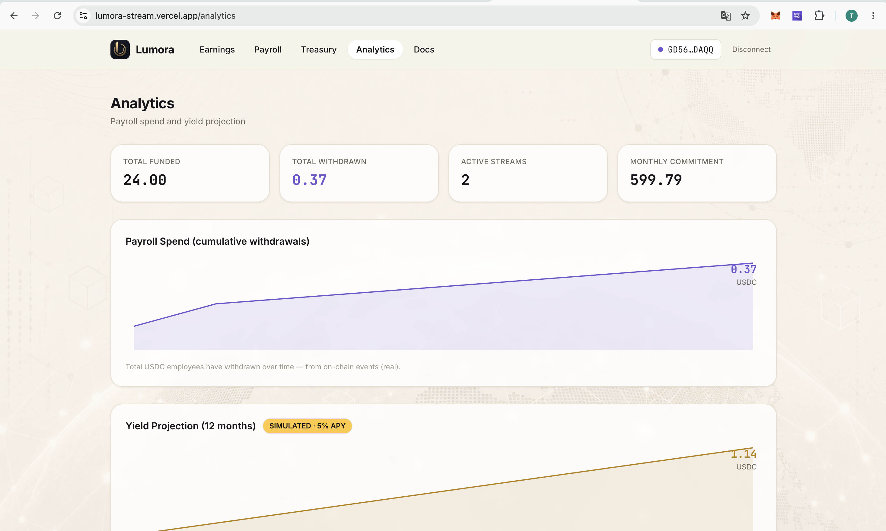
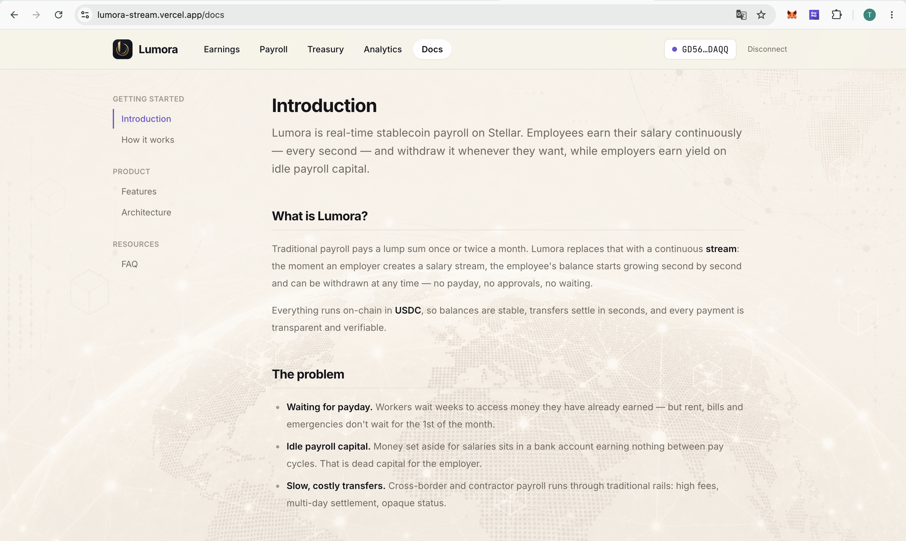
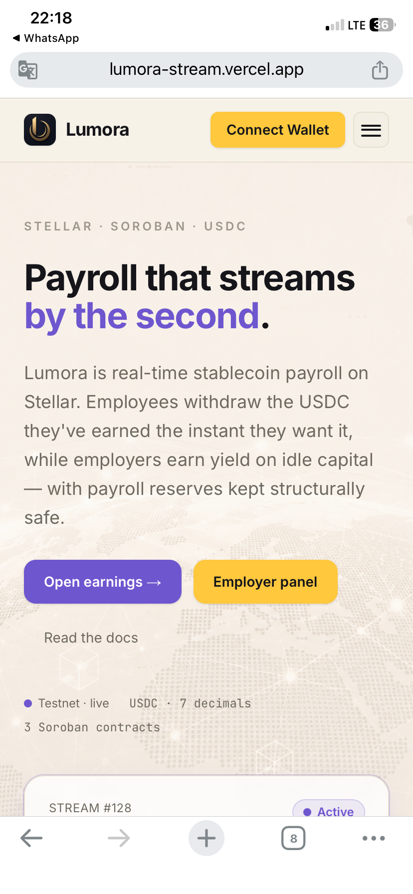
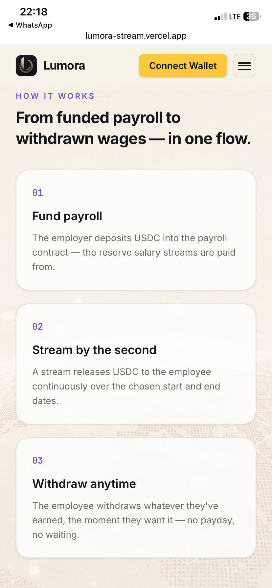

# Lumora

**A real-time, yield-aware stablecoin payroll system on Stellar.**

🔗 **Live demo:** [lumora-stream.vercel.app](https://lumora-stream.vercel.app)

Employers deposit USDC, create salary streams for employees, and employees can withdraw their earned salary at any time. Idle employer funds not allocated to payroll can earn yield in a treasury layer while active salary reserves stay protected.

## Screenshots

| Landing | Earnings — live per-second counters |
|---|---|
|  |  |
| **Payroll — fund & create stream** | **Payroll — streams & activity** |
|  |  |
| **Treasury & yield** | **Analytics** |
|  |  |
| **Docs** | |
|  | |

**Mobile**

<p>
  
  
</p>

---

- **payroll_stream:** `CCAY3UKTW6G4XUXLTWVOUYPHDIR2KOYDWELJ72PZGFBTRGRKC6NSH6OD`
- **payroll_treasury:** `CD5ERANICKKDMD3G7ULGMV5AWXAOMK4AYTIENGZNUTZEMSBIEVVJTFRY`
- **yield_strategy:** `CDYPGBBKXLO7MTTSTRU2K52LOHM7HMOISFABCIA7Y4SYSXQWHIVH22QY`
- **USDC SAC (testnet):** `CBIELTK6YBZJU5UP2WWQEUCYKLPU6AUNZ2BQ4WWFEIE3USCIHMXQDAMA` (7 decimals)

```bash
cd apps/web && npm install && npm run dev    # http://localhost:3000
bash scripts/seed-demo.sh                     # (from repo root) demo data
```

Details: **[QUICKSTART.md](QUICKSTART.md)**.

---

## Repository Layout

| Path | Contents |
|------|----------|
| `contracts/` | Soroban smart contracts (Rust): `payroll_stream`, `payroll_treasury`, `yield_strategy` |
| `apps/web/` | Next.js frontend (Earnings / Payroll / Treasury / Analytics / Docs) |
| `apps/indexer/` | Lightweight event indexer (poller → SQLite → REST) |
| `scripts/` | Deployment & demo seeding scripts |

---

## Technology Stack

- **Smart Contracts:** Rust + Soroban SDK 25 (Stellar testnet → mainnet)
- **Token:** USDC, via Stellar Asset Contract (SAC) / SEP-41 token interface (7 decimals)
- **Frontend:** Next.js 15 + React 19 + Tailwind + React Query + `@stellar/stellar-sdk`
- **Wallet:** Stellar Wallets Kit (Freighter / xBull / Lobstr / Albedo)
- **Contract client:** Auto-generated TypeScript bindings (no hand-written ABI)
- **Data:** Stellar RPC `getEvents`/simulation (primary) + Horizon (trustline/history)

---

## Practical Files

- **[QUICKSTART.md](QUICKSTART.md)** — run in 10 minutes (setup, deploy, USDC smoke test, demo seed)
- **[GLOSSARY.md](GLOSSARY.md)** — single source of definitions for all terms

---

